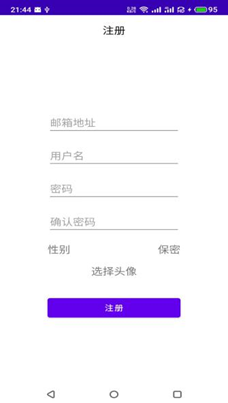
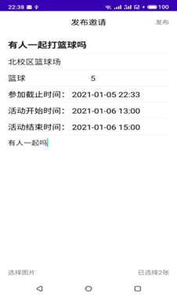
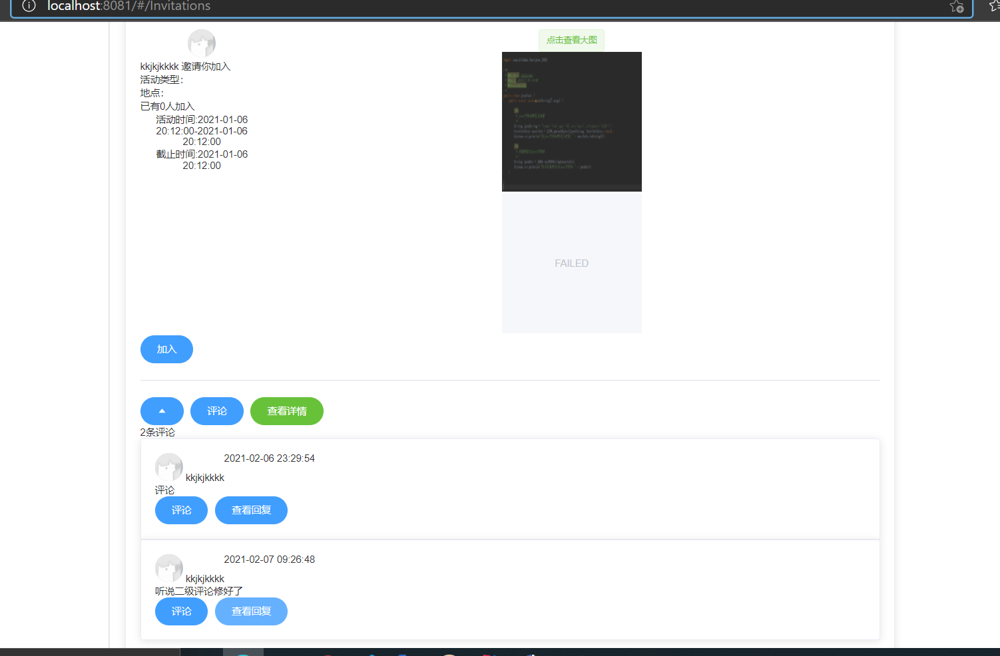

# campus_java 
## 项目介绍:
以运动爱好为主题的大学生校园交友平台。

用户通过Web端/App发布运动邀请信息，其他用户参与邀请、线下参与活动达到交友的目的
具有类似朋友圈的“校友圈“功能

## 使用技术:

使用Spring Boot、SpringBoot MVC完成Restful API开发 
使用Spring Data MongoDB完成用户信息、活动邀请、校友圈帖子的存取 
使用手写的LRU Cache完成热点帖子/邀请的缓存 
使用Vue、Vuex、Router、axios、Element-UI完成Web前端开发 

## 功能演示：
### 安卓端：

 

### Web端:
广场界面，显示运动邀请 
 
校友圈界面，分享生活 
 
支持二级评论、点赞 
  
