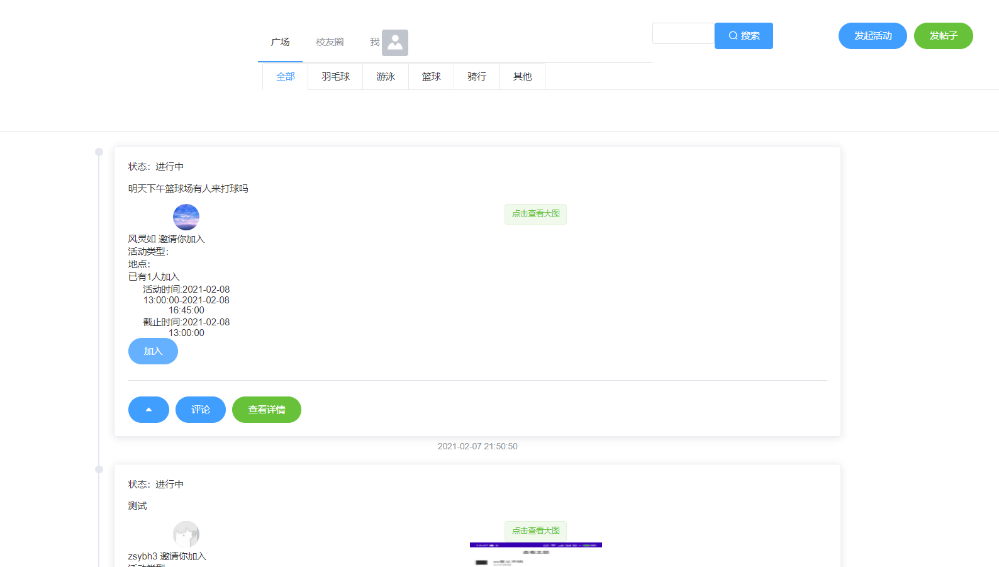
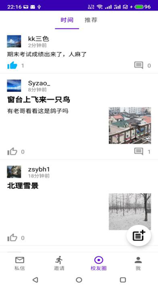

# campus_java
项目介绍: 以运动爱好为主题的大学生校园交友平台。

用户通过Web端/App发布运动邀请信息，其他用户参与邀请、线下参与活动达到交友的目的
具有类似朋友圈的“校友圈“功能

使用技术：

使用Spring Boot、SpringBoot MVC完成Restful API开发
使用Spring Data MongoDB完成用户信息、活动邀请、校友圈帖子的存取
使用手写的LRU Cache完成热点帖子/邀请的缓存
使用Vue、Vuex、Router、axios、Element-UI完成Web前端开发

功能演示：
Android端
编辑邀请

邀请界面

发布校友圈，分享生活

（支持二级评论）
注册功能

Web端：

